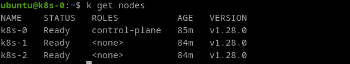
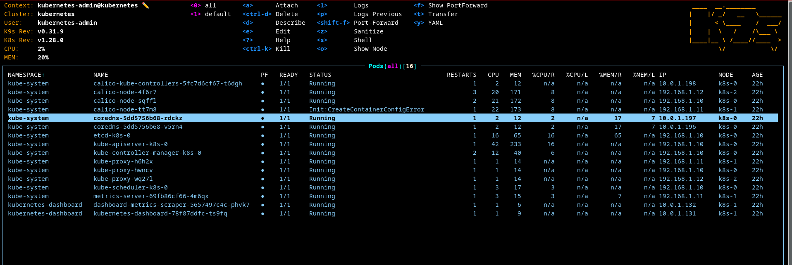

# How to deploy a k8s cluster base on kubeadm in Proxmox

(i) We assume that you already have an operational Proxmox server in place. If not, we redirect you to the following GitHub repository https://github.com/xgueret/my-homelab.

**Without further ado, let's get our hands dirty!**

```shell
.
├── ansible
├── github
├── images
├── README.md
└── terraform
```

## Provision the VM's

How to provision the VM's of the Kubernetes cluster on your Promox server

```shell
cd terraform
```

```
.
├── main.tf
├── outputs.tf
├── provider.tf
├── terraform.tfvars
└── variables.tf
```

You will need to modify the values of the following variables and environment variables.

```properties
# terraform.tfvars
# # Proxmox API credentials
pm_api_token_id = "terraform-prov@pve!terraform"  # Proxmox API token ID used for authentication
pm_api_url      = "https://proxmox.local:8006/api2/json/"  # URL of the Proxmox API
vm_count        = 3
vm_template     = "ubuntu-2204-cloudinit-template"  # Name of the Proxmox template to clone for the VM
vm_disk0_size   = "30G"        # Size of the primary disk attached to the VM (e.g., '40G' for 40 gigabytes)
vm_cpu_cores    = 2            # Number of CPU cores assigned to the VM
```

```shell
expose TF_VAR_pm_api_token_secret=...
```

To provision execute this command

```shell
terraform init
terraform plan
terraform apply
```

## Configure the k8s cluster

How to configure the cluster

```shell
cd ansible
```

```
.
├── ansible.cfg
├── inventory.yml
├── roles
└── setup-k8s.yml
```

roles

```
.
├── bootstrap-node
├── cfg-kubeadm-kubelet-kubectl
├── configure-containerd
├── init-kubeadm
├── install-cni-plugins
├── install-cri-tools
├── install-runc
├── join-workers
└── kubectl_cheat_sheet
```

to configure the cluster 

```shell
ansible-playbook setup-k8s.yml
```


tips

```ini
# hosts file
xxx.xxx.xxx.xxx   k8s-0.cluster
xxx.xxx.xxx.xxx   k8s-1.cluster
xxx.xxx.xxx.xxx   k8s-2.cluster
```

```ini
#./ssh/configi
Host k8s-0 k8s-1 k8s-2
  HostName %h.cluster
  User ansible
  IdentityFile ~/.ssh/id_vm_proxmox_rsa
  IdentitiesOnly yes
```

```shell
for host in k8s-{0..2}.cluster; do ssh-keygen -f '/home/<your_user>/.ssh/known_hosts' -R "$host"; done
```


On my Proxmox server, all my VMs are configured with SSH access for the user **ansible**. The key pair is located on my workstation.

```
ssh k8s-0
```




 :tada: Enjoy!!!!

# Outils​ :construction:

## k9s


[K9S](https://k9scli.io/) is a tool written in GO that allows you to manage a Kubernetes cluster with lots of shortcuts and colors. :smiley:

### How to Install It?

> On Linux, install [Homebrew](https://docs.brew.sh/Installation):

```shell
brew install derailed/k9s/k9s
```

### How to Configure k9s to Connect to the K8s Cluster?

To interact with your K8s cluster, k9s needs to read the `~/.kube/config` file. This file and directory do not yet exist on your workstation.

First, connect to your `k8s-0` VM and retrieve the contents of the `.kube/config` file (admin context, which can be changed later). Then, on your workstation, create a `.kube` directory, add a `config` file inside, and paste the content you copied. Done! :tada:

Launch k9s from the command line...




You will also need to install the `kubectl` CLI on your workstation  [[doc](https://kubernetes.io/fr/docs/tasks/tools/install-kubectl/)]

```shell
# Debian/ubuntu
sudo apt-get update && sudo apt-get install -y apt-transport-https
curl -s https://packages.cloud.google.com/apt/doc/apt-key.gpg | sudo apt-key add -
echo "deb https://apt.kubernetes.io/ kubernetes-xenial main" | sudo tee -a /etc/apt/sources.list.d/kubernetes.list
sudo apt-get update
sudo apt-get install -y kubectl
```


(i) For example, in k9s, when you want to edit a pod's manifest.


## :facepunch: Contribution

Contributions are welcome! If you'd like to contribute, please follow these steps:

1. **Fork the repository** to your own GitHub account.
2. **Clone your fork** locally:

```shell
git clone https://github.com/yourusername/homelab-k8s-cluster.git
cd manage-repo
```

**Create a new branch** for your feature or bug fix:

```shell
git checkout -b my-new-feature
```

**Make your changes** and commit them with a clear message:

```shell
git commit -m "Add new feature"
```

**Push your branch** to your fork:

1. ```shell
   git push origin my-new-feature
   ```

2. **Open a Pull Request** on the original repository and describe your changes.

By following these steps, you can help improve the project for everyone!
